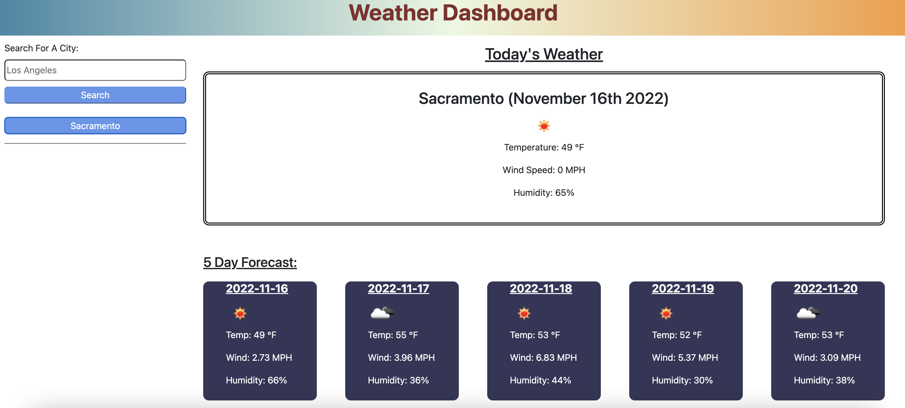

# Weather Dashboard

## Description

This website is an application that upon user request of an input entry, the application makes to different api requests that bring back current weather and forecast for next 5 days. Web Application also stores data (recent search history) this is later able to be clicked and retrieves data again.

- My motivation to build this application was to expand my knowledge in JavaScript, also to have a deeper understanding on how web api's work. It was a great motivation to also have a great portfolio project, and future potential employers will be able to get weather for their own good.

## Table of Contents

- [Description](#description)
- [Usage](#usage)
- [Credits](#credits)
- [License](#license)

## Usage 

1. Open a browser (Chrome, Safari, Mozilla, etc.)
2. Direct to the following link (https://fomin2000.github.io/weather-dashboard/)
3. Enter a city name
4. Received data will show up on screen
5. Recent searches will also show up and are clickable to retrieve data again.

## Website Link

https://fomin2000.github.io/password-generator/

## Credits

© Paul Fomin 2022

## License 

MIT License